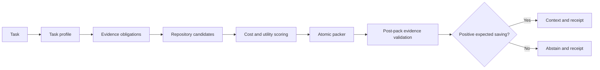

# AIRP Reliability-Constrained Context Routing Design

## Purpose

AIRP currently retrieves useful context for large-repository edits, but its
`sufficient` decision and budget filling remain heuristic. A partial result can
still create follow-up reads, a serialized payload can lose evidence without
revalidating its status, and the hook does not expose enough information to
distinguish abstention, retrieval failure, and successful context injection.

This change introduces one language-independent decision framework for Python,
TypeScript/JavaScript, and Rust. C and C++ remain supported only as experimental
parsing targets and are excluded from the commercial-benefit claim in this
iteration.

## Goals

1. Minimize expected total task context cost instead of first-payload size.
2. Mark context sufficient only when task-specific evidence obligations are met.
3. Prevent character-level truncation from invalidating evidence claims.
4. Abstain when AIRP cannot predict a material saving over ordinary repository
   reads.
5. Emit a compact decision receipt that makes routing and failure states
   observable.
6. Preserve current successful local-edit behavior for the three target language
   groups.

## Non-goals

- Guaranteeing complete dynamic-call discovery without a language server or
  runtime trace.
- Authorizing unattended merge or publication.
- Training a statistical or neural router in this iteration.
- Claiming stable support for C or C++.

## Alternatives Considered

### Fixed per-language budgets

This is inexpensive to implement but converts every failure into another rule.
It is retained only as an optional confidence calibration input.

### Reliability-constrained total-cost routing

This is the selected design. It combines evidence closure, candidate utility,
estimated follow-up cost, and safe abstention in one deterministic policy. Its
decisions remain inspectable and can later be calibrated from experiments.

### Learned routing

A learned policy may eventually improve estimates, but the current sample is too
small to separate language, repository, and task effects reliably.

## Task Evidence Obligations

The router derives a set of obligations before selecting context. Every
obligation has a role, requirement level, source, confidence, and resolution
state.

| Task shape | Required evidence |
| --- | --- |
| Local behavior edit | target implementation, callable contract, direct test when available |
| Public API edit | target implementation, public declaration or export, direct callers, compatibility test when available |
| Refactor | target implementation, behavior dependency, directly affected caller, relevant test |
| Cross-file edit | every named target, cross-file contract, directly affected module, relevant test or validation entry |
| Creation | destination file, neighboring implementation pattern, export or registration location, validation entry |

An unavailable optional test is recorded as absent rather than fabricated. A
missing target, callable contract, named symbol, or required cross-file contract
is blocking.

The result state is one of:

- `sufficient`: all blocking obligations are represented by complete blocks.
- `bounded-partial`: all blocking obligations are present but optional evidence
  is missing.
- `blocked-partial`: at least one blocking obligation is unresolved.
- `unsupported`: the repository backend cannot provide the required evidence.

The existing boolean `sufficient` remains for compatibility and is true only for
the `sufficient` state.

## Candidate Cost and Utility

Each candidate is measured as an atomic context block. The router calculates:

```text
utility = relevance * necessity * confidence * novelty
cost = packed_tokens + expected_followup_tokens + expected_repair_tokens
value = utility / max(cost, 1)
```

The first target and each blocking obligation receive reserved capacity. Other
candidates are selected in descending value order while their marginal value is
above the configured floor. A low-value candidate is not added merely because
unused budget remains.

`expected_followup_tokens` increases when an incomplete dependency or outline is
likely to require a second lookup. `expected_repair_tokens` increases for low
confidence relations, stale analysis, ambiguous anchors, or missing validation
evidence. Initial coefficients are deterministic constants documented beside the
implementation; benchmark calibration may change values without changing the
formula.

## Activation and Abstention

Before returning hook context, the router estimates:

```text
expected_airp_cost = packed_tokens + expected_followup_tokens + expected_repair_tokens
expected_native_cost = estimated direct reads and searches for the task profile
expected_saving = 1 - expected_airp_cost / expected_native_cost
```

AIRP injects context only when:

- a target or creation destination is resolved;
- no blocking evidence obligation is missing;
- the payload fits after final serialization;
- expected saving clears a conservative margin;
- the index is current or its stale state cannot affect the selected evidence.

Otherwise the hook emits no source body. It may emit a small diagnostic receipt
when the Agent needs to know which evidence is missing. The ordinary repository
tools remain the fallback path.

## Atomic Packing and Final Validation

Context consists of indivisible blocks with stable identifiers and hashes. The
packer never slices a block by characters. It reserves room for the compact
header, evidence manifest, and required target blocks before considering optional
blocks.

After serialization, AIRP recounts bytes or exact tokenizer units, rebuilds the
represented-obligation set from blocks actually present, and derives the final
status. This post-pack result is authoritative. A dropped blocking block always
downgrades the state.

## Decision Receipt

Every hook attempt records a compact local receipt containing:

```text
activation
reason
index_state
task_profile
evidence_required
evidence_represented
context_status
packed_units
expected_native_units
expected_saving
omitted_blocks
payload_hash
```

The user-facing injected context contains only fields needed by the Agent. The
local receipt retains diagnostic detail. AIRP can prove payload generation and
record downstream repeated reads; platform delivery confirmation remains an
external capability.

## Data Flow



## Language Policy

- Python uses the native AST backend as high-confidence declaration and call
  evidence.
- TypeScript and JavaScript use Tree-sitter evidence; unresolved framework and
  dynamic edges lower confidence instead of being treated as complete.
- Rust uses Tree-sitter evidence; unresolved macro-generated or trait-dispatched
  relationships lower confidence.
- Go and Java stay experimental until language-server evidence and real edit
  samples meet the same gates.
- C and C++ are excluded from this iteration's stable-benefit evaluation.

## Compatibility

Existing `task_context`, `smart_context`, and hook entry points remain available.
Responses gain structured routing, evidence, and final-status fields. Existing
clients reading `text`, `anchors`, `sufficient`, and `routing` continue to work.

## Verification

Implementation follows test-driven development. Unit tests must first demonstrate:

1. a missing blocking obligation cannot produce `sufficient`;
2. an optional missing test produces `bounded-partial`;
3. an oversized block is omitted atomically and final status is recalculated;
4. low marginal-value candidates do not fill the remaining budget;
5. a non-positive projected saving causes abstention;
6. required evidence survives cost pruning;
7. the decision receipt distinguishes bypass, abstention, failure, and activation;
8. existing Python, TypeScript/JavaScript, and Rust local-edit fixtures do not
   regress.

The deterministic experiment will then cover 240 tasks across 12 pinned real
repositories. A 24-task paired-model pilot runs only after deterministic gates
pass. It expands to 72 paired tasks when the pilot meets all release gates.

## Release Gates

- zero cases where post-pack truncation retains a false `sufficient` state;
- required-information loss below 2%;
- token-regression rate below 5%;
- correct abstention on at least 90% of negative-control tasks;
- paired task-success difference no worse than two percentage points below the
  baseline;
- median token reduction of at least 20% on activated tasks;
- no material regression in the existing test suite or plugin hook demo.

Results must report raw task rows, repository commits, failures, exclusions,
paired deltas, and repository-clustered confidence intervals. Release claims are
limited to the languages and task categories represented in the frozen test set.
